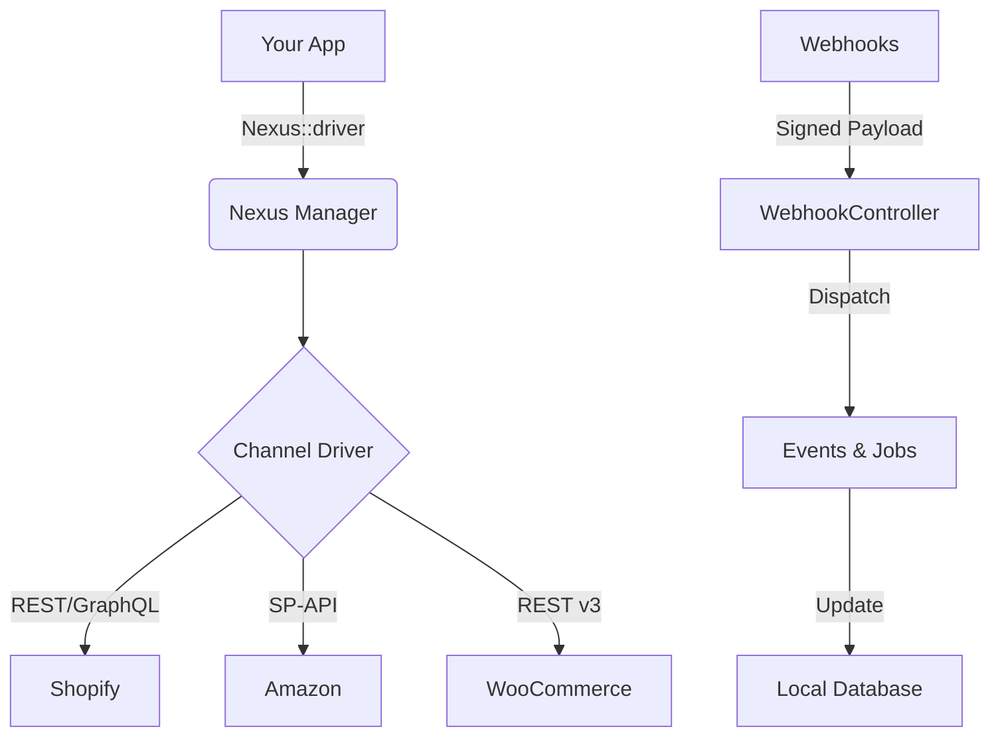

# Laravel Nexus 🚀

[](https://packagist.org/packages/malikad778/laravel-nexus)
[](https://github.com/malikad778/laravel-nexus/actions?query=workflow%3Arun-tests+branch%3Amain)
[](https://github.com/malikad778/laravel-nexus/actions?query=workflow%3A"Fix+PHP+code+style+issues"+branch%3Amain)
[](https://packagist.org/packages/malikad778/laravel-nexus)

-   **Webhooks**: Verified, secure webhook handling for real-time updates.
-   **Dashboard**: A focused administrative interface to monitor channel status and sync health.

## ❓ Why Laravel Nexus?

Building multi-channel infrastructure is **hard**. You have to deal with:
*   Different API standards (REST vs GraphQL vs SOAP).
*   Complex authentication flows (OAuth2, HMAC, AWS Signature v4).
*   Rate limiting and race conditions.
*   Keeping local database in sync with remote platforms.

**Laravel Nexus** solves this by providing a standardized, opinionated layer on top of these chaotic APIs. You write code once against the `InventoryDriver` interface, and Nexus handles the dirty work of communicating with Shopify, Amazon, or Etsy.

## 🏗️ Architecture



## 🛠️ Advanced Usage

### Custom Drivers
You can extend Nexus with your own drivers. Just implement the `InventoryDriver` interface:

```php
use Malikad778\\LaravelNexus\Contracts\InventoryDriver;

class eBayDriver implements InventoryDriver {
    // Implement getProducts, updateInventory, etc.
}
```

Then register it in your `AppServiceProvider`:

```php
Nexus::extend('ebay', function ($app) {
    return new eBayDriver($app['config']['nexus.drivers.ebay']);
});
```

### Rate Limiting Strategies
Nexus uses a **Token Bucket** algorithm backed by Redis to respect API limits. You can customize this in `config/nexus.php`:

```php
'rate_limits' => [
    'shopify' => ['capacity' => 40, 'rate' => 2], // 2 requests/sec, burst to 40
    'amazon' => ['capacity' => 15, 'rate' => 5],
],
```

## Installation

You can install the package via composer:

```bash
composer require malikad778/laravel-nexus
```

Publish the config file and migrations:

```bash
php artisan vendor:publish --tag="nexus-config"
php artisan vendor:publish --tag="nexus-migrations"
```

Run the migrations:

```bash
php artisan migrate
```

## Configuration

Add your channel credentials to your `.env` file:

```dotenv
# Shopify
SHOPIFY_SHOP_URL=your-shop.myshopify.com
SHOPIFY_ACCESS_TOKEN=shpat_...
SHOPIFY_WEBHOOK_SECRET=...

# WooCommerce
WOOCOMMERCE_URL=https://your-store.com
WOOCOMMERCE_CONSUMER_KEY=ck_...
WOOCOMMERCE_CONSUMER_SECRET=cs_...

# Amazon (SP-API)
AMAZON_CLIENT_ID=...
AMAZON_CLIENT_SECRET=...
AMAZON_REFRESH_TOKEN=...
AMAZON_SELLER_ID=...
AMAZON_REGION=us-east-1

# Etsy
ETSY_KEYSTRING=...
ETSY_SHARED_SECRET=...
ETSY_SHOP_ID=...
```

See `config/nexus.php` for advanced configuration, including rate limits and middleware settings.

## Usage

### Drivers

Access any driver using the `Nexus` facade:

```php
use Malikad778\\LaravelNexus\Facades\Nexus;

// Get products from Shopify
$products = Nexus::driver('shopify')->getProducts();

// Update inventory on Amazon
Nexus::driver('amazon')->updateInventory($sku, 50);
```

### Queue System

Nexus uses Laravel's queue system extensively. Ensure your queue worker is running:

```bash
php artisan queue:work
```

### Webhooks

Nexus automatically registers a route for incoming webhooks at `/nexus/webhooks/{channel}`.
The `VerifyNexusWebhookSignature` middleware ensures all requests are authentic.

### Importing Products

When running `ChannelSyncBatchJob` (via the scheduler or manually), Nexus fetches recent products from the configured channels.
To handle these imported products (e.g., to create local models), listen for the `Malikad778\\LaravelNexus\Events\ProductImported` event:

```php
// In EventServiceProvider
use Malikad778\\LaravelNexus\Events\ProductImported;

protected $listen = [
    ProductImported::class => [
        CreateLocalProductListener::class,
    ],
];
```

### Dashboard

Visit `/nexus` to access the Nexus Dashboard.
*Note: Make sure to configure the `dashboard_middleware` in `config/nexus.php` to secure this route (e.g., `['web', 'auth']`).*

## Testing

Run the test suite:

```bash
composer test
```

## License

The MIT License (MIT). Please see [License File](LICENSE.md) for more information.
